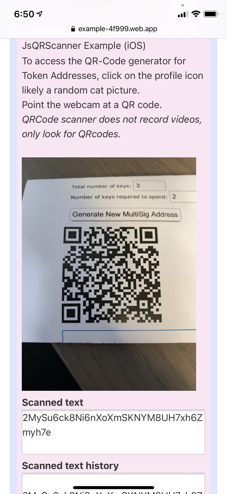
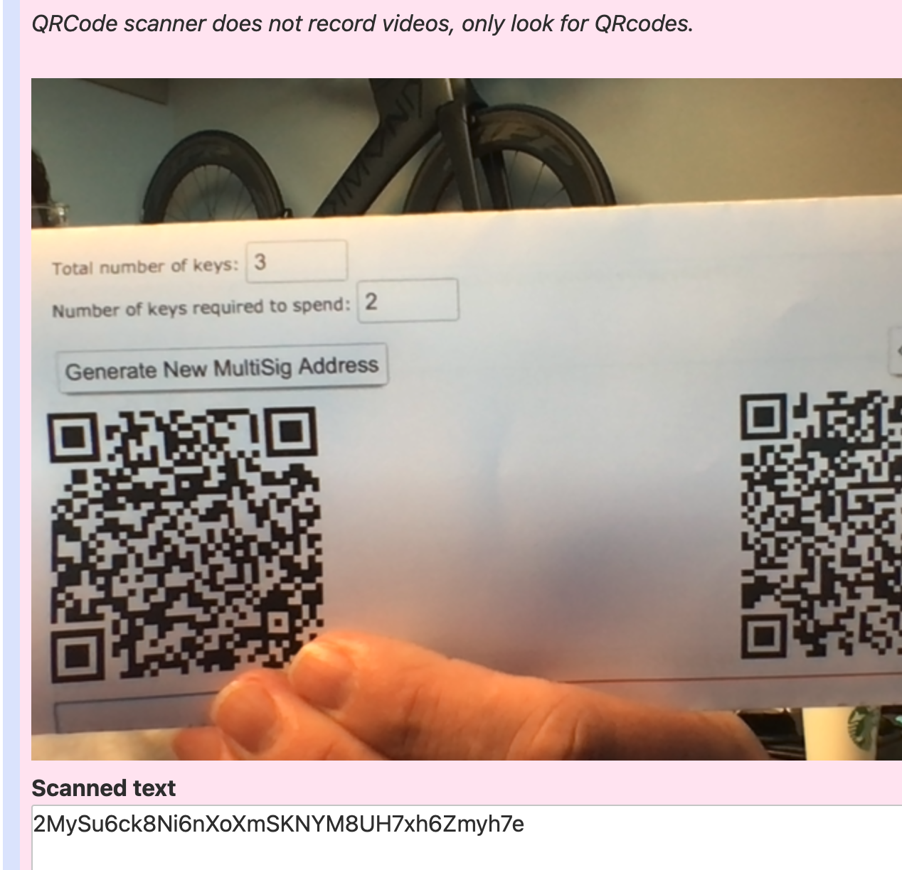
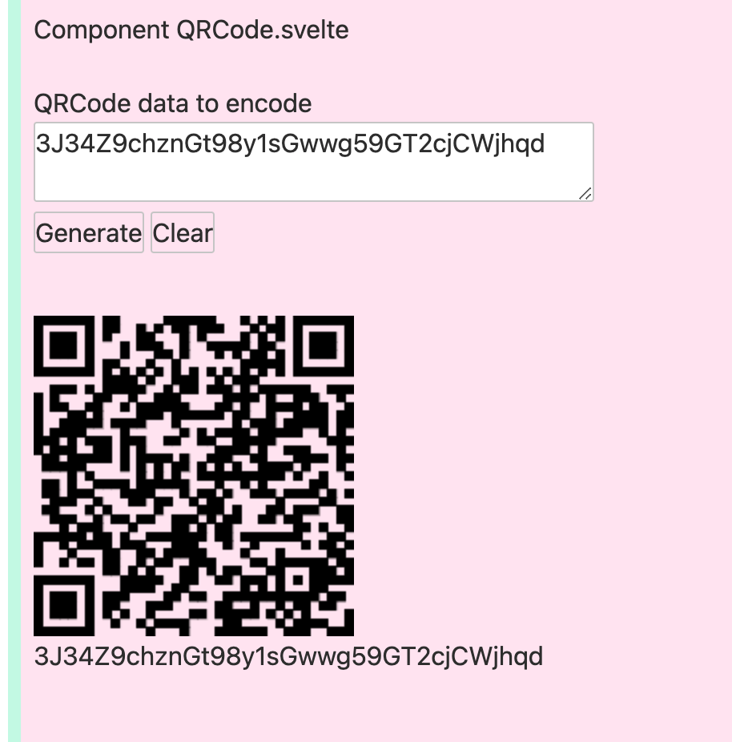

# Svelte QR-Code Scanner, Svelte QR-Code Reader, etc.

Safari Mobile
<div style="text-align:center;">
<a href='https://example-4f999.web.app/'>

</a>
</div>

[See demo](https://example-4f999.web.app/)

## Highlights
* [Pattern for loading external libraries in Svelte](./routify/src/pages/_components/LibLoader.svelte)
* [JsQr Code Scanner via Camera](./routify/src/pages/_components/JsQRScanner.svelte)
* [Qr Code Generator](./routify/src/pages/_components/QR.svelte)

JsQR Code Scanner works in the browser, desktop and mobile including Safari. Based on [this](https://davidshimjs.github.io/qrcodejs/) and [this](https://github.com/schmich/instascan).

Chrome 
<div style="text-align:center;">
<a href='https://example-4f999.web.app/'>


</a>
</div>

## Repository Contents
Landing page has links to the Tailwind example landing pages, and other layouts, a keyboard handler for site-wide keyboard command captures, example Svelte store configuration and site settings, notification and alerts, <u>JsQRCode code scanner</u> with history output, Firebase Login Google, Github, Anonymous, and dark mode. After login as anonymous, clicking on the profile picture, an internal profile page with examples of child, grandparent, parent data passing, <u>QR Code Address generator</u> and Firebase login information.

## Project Components
* [Firebase](./routify/src/firebase/config.ts)
* [Firebase Login Google, Github, Anonymous](./routify/src/pages/auth/)
* [Firebase Hosting](./scripts/set_env.sh)
* Typescript
* Tailwind
* Svelte
* Routify 

## Firebase
The above config may be missing as it is part of .gitignore, the file looks like:

```typescript
export const exampleConfig = {
    projectId: "",
    messagingSenderId: "",
    appId: "",
    apiKey: "",
    authDomain: "",
    databaseURL: "",
    storageBucket: "",
    measurementId: ""
};
```
Additionally, there is an [set_env.sh](./scripts/set_env.sh) which you may set your hosting, firebase variables to generate .env files, set the Firebase environment variables etc. For those times when Routify misbehaves, there is also a [kill_ports.sh](./scripts/kill_ports.sh) which as the name suggests, will provide a menu of applications using ports for you to kill easily.

## Overview of Svelte Components
* [Svelte Component Loader](./routify/src/pages/_components/LibLoader.svelte)
* [Svelte QR Code Camera Scanner (JSQRScanner)](./routify/src/pages/_components/Instascan.svelte)
* [Svelte QR-Code Generator](./routify/src/pages/_components/QR.svelte)
* [Chrome T-Rex Game](./routify/src/pages/t-rex/index.svelte)
* [Firebase Login](./routify/src/pages/auth/)


### Svelte JsQRScanner
The Svelte component is located in `./routify/src/pages/_components/JsQRScanner.svelte`. 

```svelte
<script lang="ts">
    import Scanner from "./JsQRScanner.svelte";
</script>

<section id="Scanner" class="px-2 py-2 bg-white-200 md:py-24">    
    <Scanner />
</section>
```

You may want to expose additional events to capture the scanned text. Currently it outputs to:

```html
<div class="FlexPanel form-field-input-panel">
    <textarea
        id="scannedTextMemo"
        class="textInput form-memo form-field-input textInput-readonly"
        rows="3"
        readonly
    />
</div>
```

### Firebase Cloud Functions
The Cloud Functions portion of the repo contains code for managing Twilio inbound and outbound voice and SMS, Sendgrid, and Slack of which could be used for a scalable robo-dialer system. This system is discussed in its own repo, however some information can be found [here.](./functions/Readme.md) Please be considerate, this system was used with individuals who had previously consented to being contacted. 

### Setup Hosting
This template requires just the hosting file to set up, however, if your application includes other Firestore/Hosting features you may want to update the second configuration helper.

* Update Firebase config ` routify/src/firebase/config.ts`
* Update Firebase config settings in ` ./scripts/set_env.sh`

After you have your `config.ts` sorted out, the following should work.

```sh
cd routify && npm i && npm run build && npm run dev
```

Visit https://localhost:5000

Enjoy!